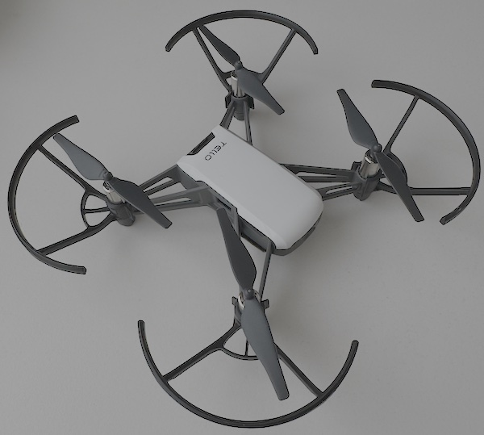

# DJI Tello - Python



This software makes use of: [DJI Tello Python API](https://djitellopy.readthedocs.io/en/latest/tello/)

## Important

The owner of this project assumes no responsibility for any damage, issues, or legal consequences resulting from the use of this software. Use it at your own risk and ensure compliance with all applicable laws and regulations.

## Installation

### Minimum requirements

The code is written and tested with following requirements:

| OS            | Python                                                                                                         |
|---------------|----------------------------------------------------------------------------------------------------------------|
| macOS Sequoia | [](https://python.org)                            | 
| macOS Sequoia | [](https://github.com/trezor/cython-hidapi)       |
| macOS Sequoia | [](https://github.com/damiafuentes/DJITelloPy) |
| macOS Sequoia | [](https://github.com/opencv/opencv-python)    |
| macOS Sequoia | [](https://numpy.org)                               |
| Debian 12     | [](https://python.org)                           | 
| Debian 12     | [](https://github.com/gvalkov/python-evdev)         |
| Debian 12     | [](https://github.com/damiafuentes/DJITelloPy) |
| Debian 12     | [](https://github.com/opencv/opencv-python)    |
| Debian 12     | [](https://numpy.org)                               |

### Quick installation

```shell
# clone repository
$ git clone https://github.com/Lupin3000/Tello-Python.git

# change into cloned root directory
$ cd Tello-Python/

# create Python virtualenv (optional but recommended)
$ python3 -m venv venv

# activate Python virtualenv
$ source venv/bin/activate

# update pip (optional)
(venv) $ pip3 install -U pip

# install required dependencies
(venv) $ pip3 install -r <SYSTEM>-requirements.txt

# show packages (optional)
(venv) $ pip3 freeze
```

> For more details, have a look on the [Wiki](https://github.com/Lupin3000/Tello-Python/wiki/Installation). There, various systems are discussed in more detail.

## Usage

### Run application and fly

1. **Mandatory:** Connect controller by USB or Bluetooth (_verify correct mapping configuration `config/*.ini`_).
2. **Mandatory:** Turn on Tello Drone (_in best case the drone is 100% charged_).
3. **Mandatory:** Connect WLAN of your computer to the Tello Drone AP (_Default is: TELLO-??????_).
4. **Optional:** Decide whether you want to enable or disable the HUD (_for video streaming_).
5. **Optional:** Check your surroundings to see if you can fly the drone safely.
6. **Mandatory:** Run the Python application (_use file `main.py`_).

```shell
# run application
(venv) $ python3 main.py
```

> After takeoff, the Tello sensors require a few seconds to calibrate. During this time, the drone will not respond to controller inputs.

## Configuration

### Predefined controllers

**Controllers**

| OS    | Controller                         | Configuration       |
|-------|------------------------------------|---------------------|
| macOS | Google Stadia-Controller           | stadia_macos.ini    |
| macOS | Sony DualSense Wireless Controller | dualsense_macos.ini |
| Linux | Google Stadia-Controller           | stadia_linux.ini    |
| Linux | Sony DualSense Wireless Controller | dualsense_linux.ini |

**Assignment**

- **Stadia [Y] - DualSense [&#x25B2;]:** for drone takeoff.
- **Stadia [A] - DualSense [X]:** for drone landing.
- **Stadia [X] - DualSense [&#x25FC;]:** for capture a photo (_picture will be saved as PNG into directory "photos"_).
- **Left analog stick:** move up, move down, rotation clockwise and rotation counterclockwise.
- **Right analog stick:** move forward, move backward, move left and move right.

> The photos are created as PNG files (_with timestamp in name_) during the live stream. The resolution and quality therefore depend on the live stream. The `photos` folder will be created automatically if it doesn't already exist. If you turn off the stream, you cannot save pictures!

### Own configuration

In the [Wiki](https://github.com/Lupin3000/Tello-Python/wiki/Configuration) you will find more details to create your own configurations.

## Notes

### Compatibility

Currently, this project is only fully supported on macOS. Users on other operating systems might encounter compatibility issues or limitations when running the project. Please ensure you are using macOS for the best experience.

### Open items

- Linux compatibility (_via Python evdev_) -> in testing
- Add more controller actions (_eq. drone flip, video recording, etc._)
